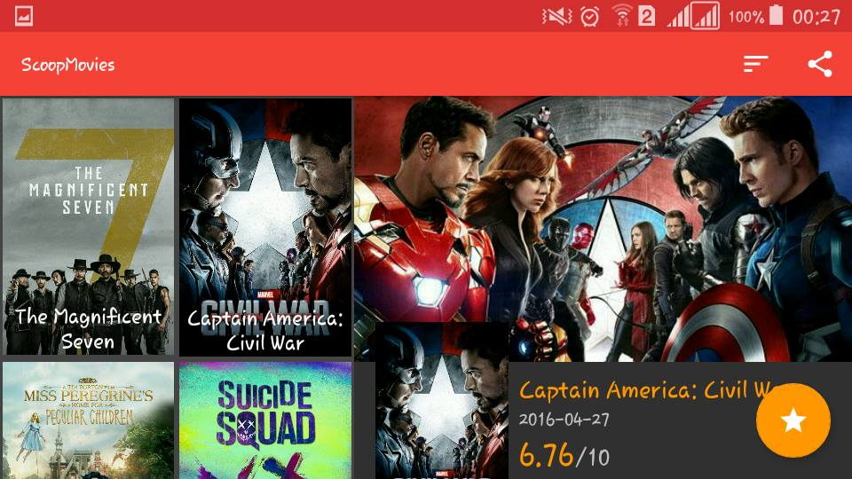
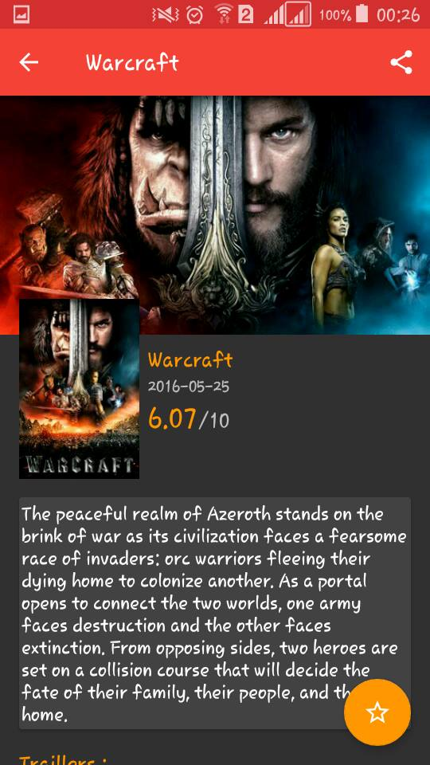
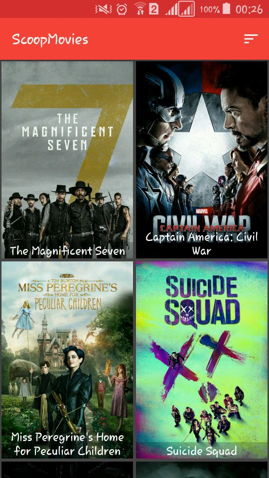

# ScoopMovies :Udacity Popular Movies Project
<h3>Open source project as a part of Android Developer Nanodegree from Udacity.</h3>
 
● Movie discovery and tracking app that allows you to mark movies as "Top rated or "popular" and saves them in an SQLite database. 
● Uses http://themoviedb.org API to get movie lists and details using Volley. (Networking Library) 
● Watch trailers, read reviews, mark as favorit , share movies , etc.
 

Pre-requisites
--------------
Android SDK 21 or Higher
Build Tools version 21.1.2 Higher
Android Support AppCompat 22.2.0 or Higher
Android Support Annotations 22.2.0
Android Support GridLayout 22.2.0
Android Support CardView 22.2.0
Android Support Design 22.2.0
Android Support RecyclerView 22.2.0
BumpTech Glide 3.5.2
Volley 1.0.0 
Recyclerview-animators:2.2.4

Screen Shots
------------
 

 
Demo
----
https://www.youtube.com/watch?v=cU8DXF7W09c

