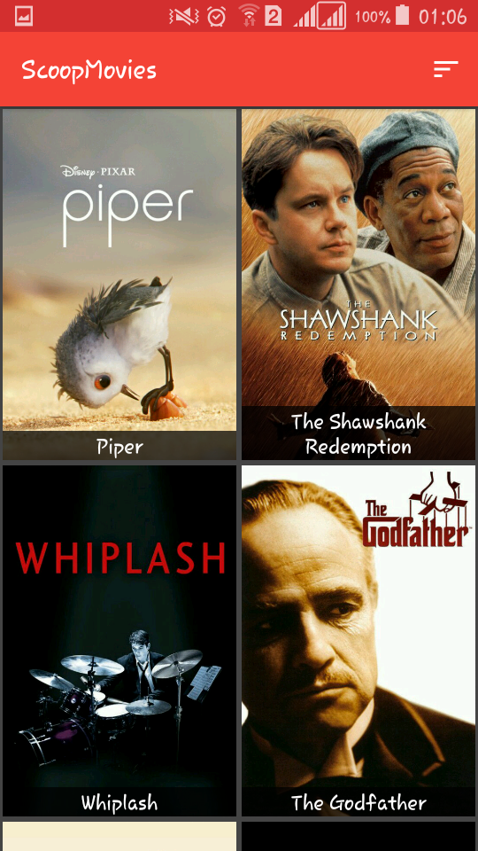

# ScoopMovies :Udacity Popular Movies Project
<h3>Open source project as a part of Android Developer Nanodegree from Udacity.</h3>
 
● Movie discovery and tracking app that allows you to mark movies as "Top rated or "popular" and saves them in an SQLite database. 
● Uses http://themoviedb.org API to get movie lists and details using Volley. (Networking Library) 
● Watch trailers, read reviews, mark as favorit , share movies , etc.
 

 
 

